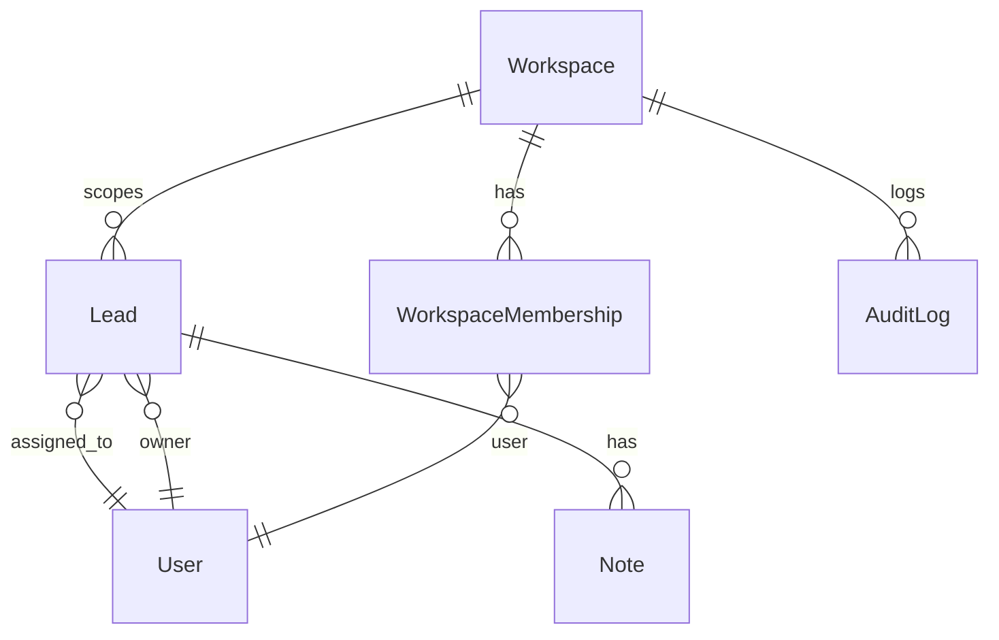

# Architecture Map

## Repo structure
```
Micro-CRM/
  backend/
    leadflow/                 # Django project (settings/development.py, settings/production.py)
    apps/
      leads/                  # Lead, Note, Tag, SavedView, Proposal — core pipeline
      workspaces/              # Workspace, WorkspaceMembership, WorkspaceInvite, AuditLog
      reminders/                # Celery tasks — only app that currently sends real email
    manage.py
  frontend/
    src/
      components/               # Pipeline, LeadForm, LeadDetailPanel, Settings/Team
      services/                  # leadsService.js, noteService.js, workspaceService.js
      context/                    # AuthContext (workspace role + permissions)
```

## Backend apps and responsibility
- **`apps/leads`** — `Lead` model (pipeline, deal economics, source/lost_reason), `Note` model (activity timeline), `Tag`, `SavedView`, `Proposal`, `money_stats` endpoint
- **`apps/workspaces`** — multi-tenancy: `Workspace`, `WorkspaceMembership`, `WorkspaceInvite`, `AuditLog`, role-based permission classes
- **`apps/reminders`** — Celery + Redis background tasks; currently the *only* app that sends real email

## Data model (current)


## Multi-tenancy model (Phase 2 foundation)
- One agency = one `Workspace` (single workspace per agency today — multi-workspace support is Phase 3)
- Every `Lead` carries a `workspace` FK; all queries are workspace-scoped
- Signup auto-creates a `Workspace` and makes the creator `Admin`

## Role-based access
| Role | Lead visibility | Manage users | Export | Audit |
|---|---|---|---|---|
| Admin | All leads in workspace | Yes (invite / change role / deactivate) | Yes | Yes |
| Manager | All leads in workspace | View only | Yes | Yes |
| Member | `assigned_to = me OR owner = me` | No | No | No |

Enforced via DRF permission classes (`has_permission` + `has_object_permission`) — not just frontend hiding. Full permission key list lives in `05_API_DATABASE_MAP.md`.

## Audit logging concept
`AuditLog` records: actor, action, target object, before/after (where relevant), timestamp. Currently logs: lead create/update, role changes, invites, CSV export. **Extend this table for new audited actions rather than building a parallel logging system.**

## Deployment architecture
- **Backend:** AWS EC2 t2.micro, Ubuntu 22.04 — Nginx → Gunicorn (Unix socket `/tmp/microcrm.sock`) → Django
- **DB:** PostgreSQL in production; SQLite for local dev when `DATABASE_URL` is unset
- **Background jobs:** Celery + Redis
- **TLS:** Let's Encrypt via DuckDNS
- **CI/CD:** GitHub Actions
- **Uptime monitoring:** UptimeRobot
- **Frontend:** Vercel

## Auth
JWT-based. Known non-blocking warning: JWT key length — flagged in `07_RISKS_BUGS.md`, not yet fixed.

## Local dev
```powershell
# Backend
cd Micro-CRM/backend
.venv\Scripts\Activate.ps1
$env:DATABASE_URL="sqlite:///db.sqlite3"   # omit to use the configured default
python manage.py migrate
python manage.py runserver

# Frontend (separate terminal)
cd Micro-CRM/frontend
npm run dev
```
For Docker/Postgres: set `DATABASE_URL` in `.env` before migrating, then `docker compose up db redis backend`.
